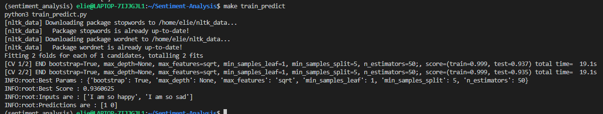
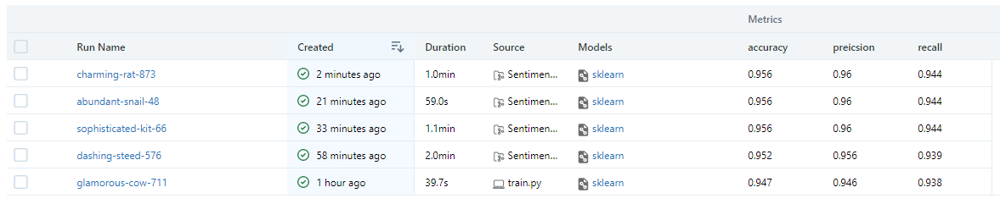
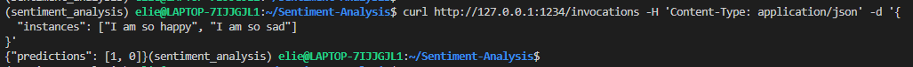

# Sentiment Analysis

Sentiment analysis using ML

## Project Organization

    ├── LICENSE
    ├── Makefile           <- Makefile with commands like `make data` or `make train`
    ├── README.md          <- The top-level README for developers using this project.
    ├── data
    │   ├── external       <- Data from third party sources.
    │   ├── interim        <- Intermediate data that has been transformed.
    │   ├── processed      <- The final, canonical data sets for modeling.
    │   └── raw            <- The original, immutable data dump.
    │
    ├── docs               <- A default Sphinx project; see sphinx-doc.org for details
    │
    ├── models             <- Trained and serialized models, model predictions, or model summaries
    │
    ├── notebooks          <- Jupyter notebooks. Naming convention is a number (for ordering),
    │                         the creator's initials, and a short `-` delimited description, e.g.
    │                         `1.0-jqp-initial-data-exploration`.
    │
    ├── references         <- Data dictionaries, manuals, and all other explanatory materials.
    │
    ├── reports            <- Generated analysis as HTML, PDF, LaTeX, etc.
    │   └── figures        <- Generated graphics and figures to be used in reporting
    │
    ├── requirements.txt   <- The requirements file for reproducing the analysis environment, e.g.
    │                         generated with `pip freeze > requirements.txt`
    │
    ├── setup.py           <- makes project pip installable (pip install -e .) so src can be imported
    ├── src                <- Source code for use in this project.
    │   ├── __init__.py    <- Makes src a Python module
    │   │
    │   ├── data           <- Scripts to download or generate data
    │   │   └── make_dataset.py
    │   │
    │   ├── features       <- Scripts to turn raw data into features for modeling
    │   │   └── build_features.py
    │   │
    │   ├── models         <- Scripts to train models and then use trained models to make
    │   │   │                 predictions
    │   │   ├── predict_model.py
    │   │   └── train_model.py
    │   │
    │   └── visualization  <- Scripts to create exploratory and results oriented visualizations
    │       └── visualize.py
    │
    └── tox.ini            <- tox file with settings for running tox; see tox.readthedocs.io

---

<p><small>Project based on the <a target="_blank" href="https://drivendata.github.io/cookiecutter-data-science/">cookiecutter data science project template</a>. #cookiecutterdatascience</small></p>

---

## Functional Part

### Use Case

Our project is a Sentiment Analysis Machine Learning project, built using nltk and RandomForestClassifier. The project aims to create an ML model that takes as input a sentence, and tries to predict the sentiment in the sentence, positive or negative.

## Techinal Part

### Requiremenets

The project requirements in the [requirements](requirements.txt) file.

### Setup

To create the environment to execute the project, follow these steps:

- Create new conda environment:
  ```
  make create_environment
  ```
- Activate the environment
  ```
  source activate sentiment_analysis
  ```
- Install the requirements
  ```
  make requirements
  ```

### Train the model

To train the model, you can use the train_predict.py file as an example, or run `make train_predict`.

Two pickle files will be created in the root of the folder:

- classifier.pkl: The trained RandomForestClassifier.
- feature_engineer.pkl: The feature engineering class to be used for before inference.

.

#### Data

The data used for training the model is a txt file placed under [this folder](data/raw/), called train.csv with the following format:

```
i didnt feel humiliated;sadness
```

Each line is one sample, first column is the text, and second is the category. The data is `;` separated.

#### Documentation

To generate the documentation for the project, run:

```
cd docs
make html
```

The documentation are generated under [here](docs/build/html/index.html)

#### ML Schduling

In order to schedule the retraining of the module, our proposed solution is using airflow to create a dag that every set period of time (1 day, 1 wekk, ...) fetchs the latest version of the data, and overrides the train.txt file under [here](data/raw/). Next step in the dag is executing `make train_predict` to create a new trained model on the latest training data.

### MLFlow

We integrated MLFlow into our project in order to track our experiments, and find best parameters and scores.

#### Train model with mlflow

To train the model with mlflow enabled you can run:

- `python train.py`
- `mlflow run . -P max_depth=2 --env-manager=local`

#### View Experiment Results

To view the experiment results, run `mlflow ui`, and navigate to `http://localhost:5000`

 .

#### Model deployment

To deploy the trained model, all you have to do is get the path of the pipeline artifact, and run

```
mlflow models serve -m <path> -p 1234
```

To call the endpoint:

```
curl http://127.0.0.1:1234/invocations -H 'Content-Type: application/json' -d '{
  "instances": ["I am so happy", "I am so sad"]
}'
```

.
